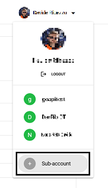
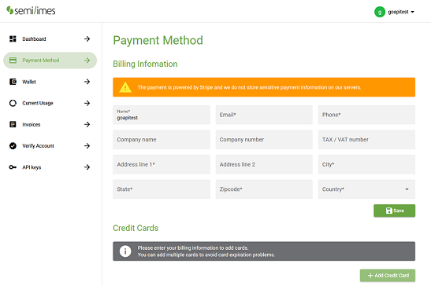
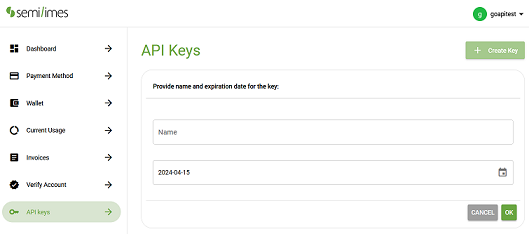
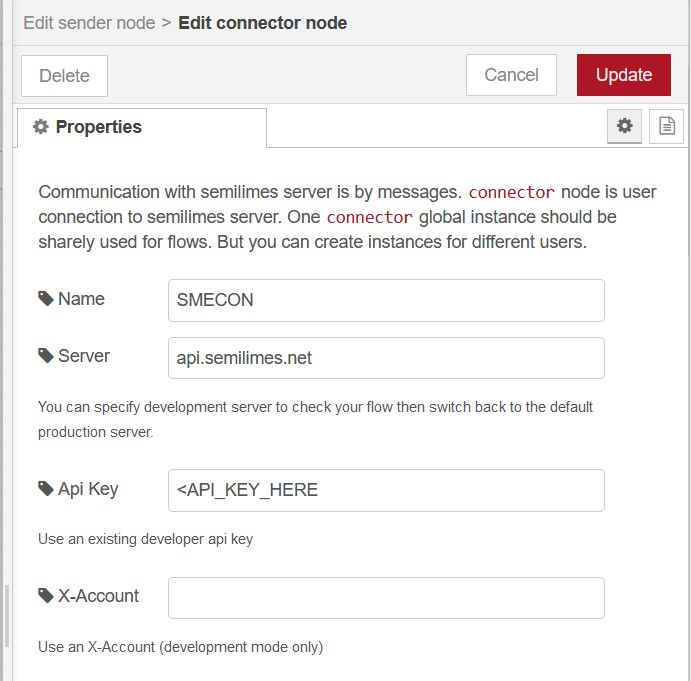
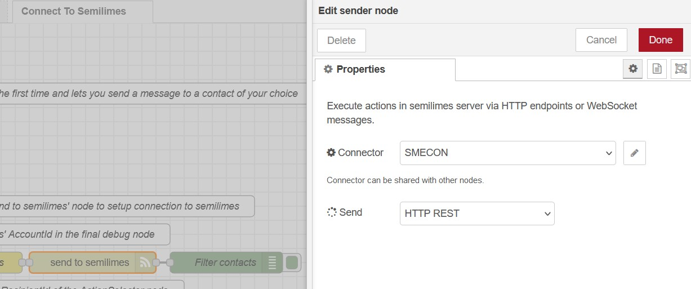

# Node-RED semilimes connector
[](https://nodered.org)   [](http://www.apache.org/licenses/LICENSE-2.0) [](https://github.com/semilimes/nodered-publicapi-connector) [](https://www.npmjs.com/package/@semilimes/node-red-semilimes)

This Node-RED package lets you extend your semilimes experience with automation and IoT capabilities, such as the implementation of auto replies, booking flows, control dashboards or message-based interfaces, all exposed through your semilimes app.

[Github project](https://github.com/semilimes/nodered-publicapi-connector)

[Official semilimes API Documentation](https://www.semilimes.com/developers/)

## Install
[](https://nodei.co/npm/@semilimes/node-red-semilimes/)

You can install the nodes by either
- using node-red's "Manage palette" in the side bar and searching for `node-red-semilimes`
  
  or
- running the following command in the root directory of your Node-RED installation
    ```
    npm install @semilimes/node-red-semilimes --save
    ```


## Setup your developer environment

1. Install the semilimes app through the [Official semilimes Website](https://www.semilimes.com/apps/) or by using the following direct store links 
   - **iOS** : [](https://apps.apple.com/us/app/semilimes-mesh/id1536363738?l=en)  

   - **Android** : [](https://play.google.com/store/apps/details?id=net.semilimes.messenger&hl=en&gl=US)  

2. Access the [semilimes Services](https://my.semilimes.net) website and login using the on-screen instructions
   
3. Create a subaccount
   
   
   
4. Enter billing information for the created subaccount

    

5. Request an API Key for your new subaccount

    

## Connect to semilimes

1. Add a standard `inject` node

2. Add and connect a `Sender` node, select `Channel - Create` and give it a title. This will be your new channel name. Make sure you give a value to the `Save ChannelId` property, you will reuse this later.

3. In the same node, configure its `Connector` property to create a connection configuration, and enter your API key.


4. Add and connect a `Message` node and select the `Text` message option, then enter a message in the Text field.

5. Add and connect another `Sender` node, this time for actually sending the message. Select `Channel - Send` and configure its `ChannelId` property with the one you previously saved in step 2.

6. Make sure you select the previously created `Connector` in this node as well.


7. Run the flow and access your semilimes app with the subaccount corresponding to your API key. You will find a new channel containing your first message!

For reference, your completed flow should look like this


# Examples

You can find all the provided examples by importing them from this Node-RED package, or you can explore and import them manually at this GitHub link:

[All Example flows](https://github.com/semilimes/nodered-publicapi-connector/tree/main/examples)


## Dependencies
The nodes are tested on linux environments with `Node.js v19.2.0` and `Node-RED v3.0.2`

# License
Apache License
Version 2.0, January 2004
http://www.apache.org/licenses/
