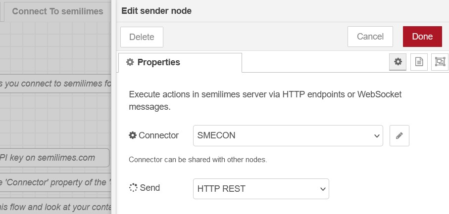

# Node-RED semilimes connector
     

This package of Node-RED nodes to extends your semilimes account with your programming ability, such as auto reply, booking flow or even message-base interface of your exsting system to expose to semilimes Messenger.

[Github project](https://github.com/semilimes/nodered-publicapi-connector)

[Official semilimes API Documentation](https://www.semilimes.com/developers/)

## Installation

You can install the nodes using node-red's "Manage palette" in the side bar.

Or run the following command in the root directory of your Node-RED installation

    npm install node-red-contrib-semilimes-connector --save

## Installation of the mobile apps
- IOS semilimes Messenger :   

- Android semilimes Messenger :   

## Dependencies
The nodes are tested with `Node.js v19.2.0` and `Node-RED v3.0.2`.

## Connect to semilimes
1. Get an API key on [Semilimes Website](https://www.semilimes.com)

1. Add a new `Text` node and configure it with your preferred message

1. Add an `Action Selector` node and select 1. Add an `action selector` node and select the `Account - Get Contacts` to get a list of contacts to send a message to.

1. Add a `sender` node then config its `Connector` property to create a `connector` configuration.

1. Configure the `connector` node with your API key and connect it to semilimes.

1. Run the flow and get your contacts list. Save the preferred AccountId

1. In another flow, add a `Text` node with a message

1. Add an `Action Selector` node and select `P2P - Send Message` and set the AccountId you saved in the RecipientId field

1. Add a `sender` node and run. You have sent your first message!

Sample flow to connect to semilimes and send your first message.
[Connect to semilimes flow](https://github.com/semilimes/nodered-publicapi-connector/blob/main/examples/Connect%20To%20Semilimes%20flow.json)

# Examples
- [All Example flows](https://github.com/semilimes/nodered-publicapi-connector/tree/main/examples)

## Handy setup connection to semilimes
Communication with semilimes is API-key based

# License
Apache License
Version 2.0, January 2004
http://www.apache.org/licenses/
