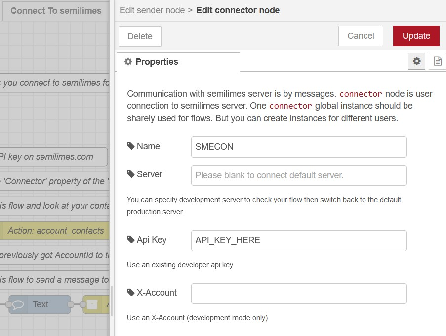

# Node-RED semilimes connector
[](https://nodered.org)   [](http://www.apache.org/licenses/LICENSE-2.0) [](https://github.com/semilimes/nodered-publicapi-connector) [](https://www.npmjs.com/package/@semilimes/node-red-semilimes)

This Node-RED package lets you extend your semilimes experience with automation and IoT capabilities, such as the implementation of auto replies, booking flows, control dashboards or message-based interfaces, all exposed through your semilimes app.

[Github project](https://github.com/semilimes/nodered-publicapi-connector)

[Official semilimes API Documentation](https://www.semilimes.com/developers/)

## Install
[](https://nodei.co/npm/@semilimes/node-red-semilimes/)

You can install the nodes by either
- using node-red's "Manage palette" in the side bar and searching for `node-red-semilimes`
  
  or
- running the following command in the root directory of your Node-RED installation
    ```
    npm install @semilimes/node-red-semilimes --save
    ```


## Setup your developer environment

1. Install the semilimes app through the [Official semilimes Website](https://www.semilimes.com/apps/) or by using the following direct store links 
   - **iOS** : [](https://apps.apple.com/us/app/semilimes-mesh/id1536363738?l=en)  

   - **Android** : [](https://play.google.com/store/apps/details?id=net.semilimes.messenger&hl=en&gl=US)  

2. Access the [semilimes Services](https://my.semilimes.net) website and login using the on-screen instructions
   
3. Create a subaccount
   
   
   
4. Enter billing information for the created subaccount

    

5. Request an API Key for your new subaccount

    

## Connect to semilimes

1. Add a new `Text` node and configure it with your preferred message

2. Add an `Intent` node and config its `Connector` property to create a `connector` configuration. Configure the node by selecting the `Channel - Create` intent and entering a title for the new channel.


1. Add a `sender` node then config its `Connector` property by selecting the previously created connector.
2. 


3. Run the flow to create the new channel.

4. In another flow, add a `Text` node with a message

5. Add an `Intent` node and select `Channel - Send Message` and configure the channel

6. Add a `sender` node and run.

The flow should look like this [example](https://github.com/semilimes/nodered-publicapi-connector/blob/main/examples/Connect%20To%20semilimes%20flow.json)


You have sent your first message!


# Examples

You can find all the provided examples by importing them from this Node-RED package, or you can explore and import them manually at this GitHub link:

[All Example flows](https://github.com/semilimes/nodered-publicapi-connector/tree/main/examples)


## Dependencies
The nodes are tested on linux environments with `Node.js v19.2.0` and `Node-RED v3.0.2`

# License
Apache License
Version 2.0, January 2004
http://www.apache.org/licenses/
